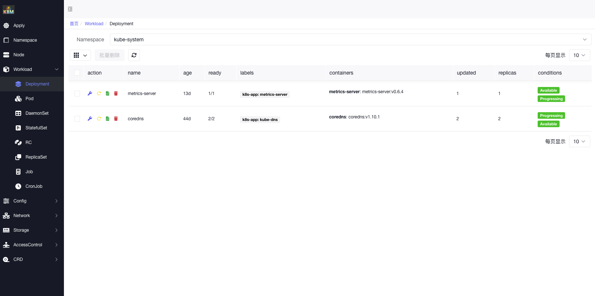
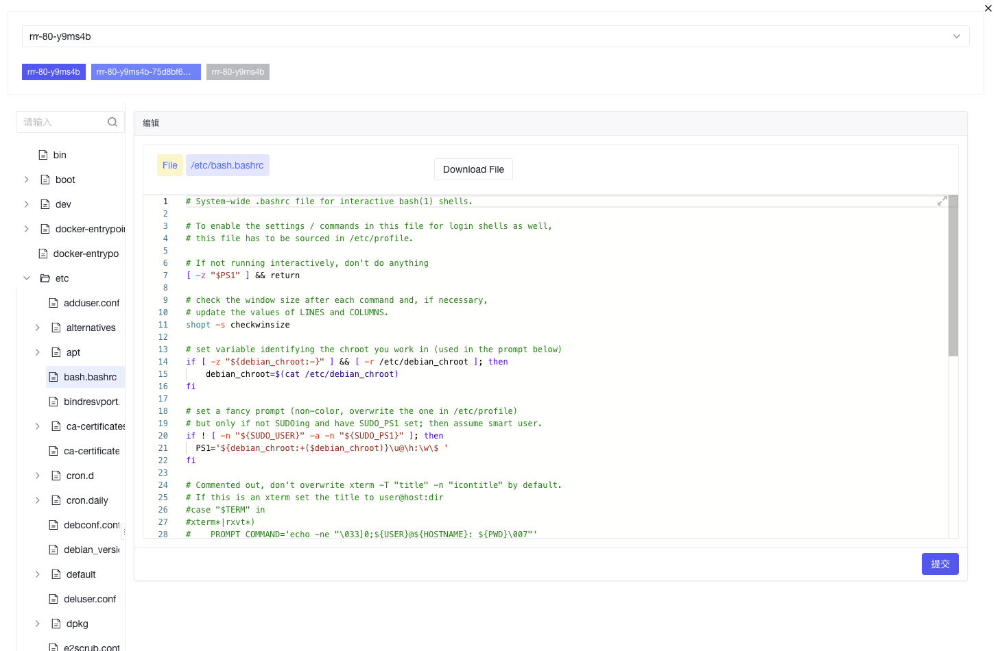
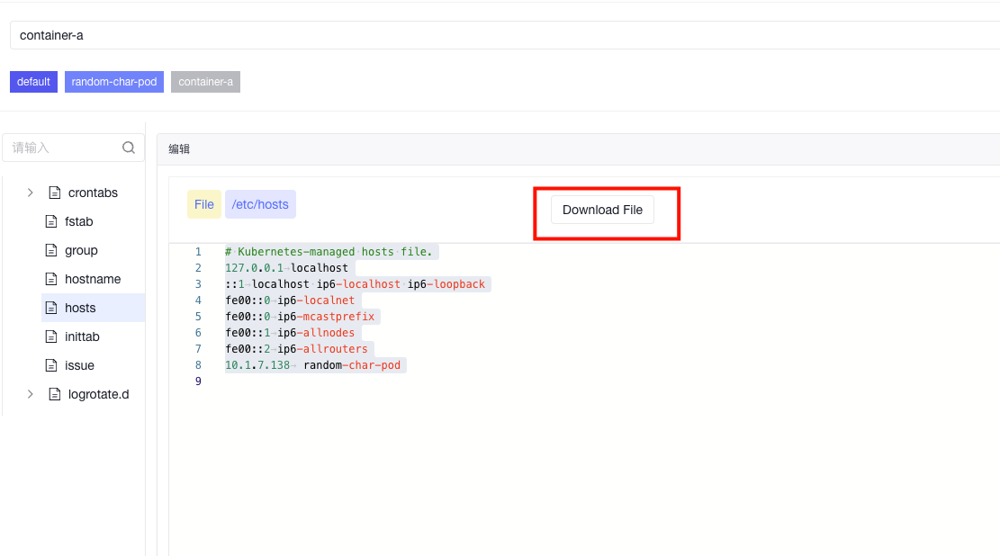
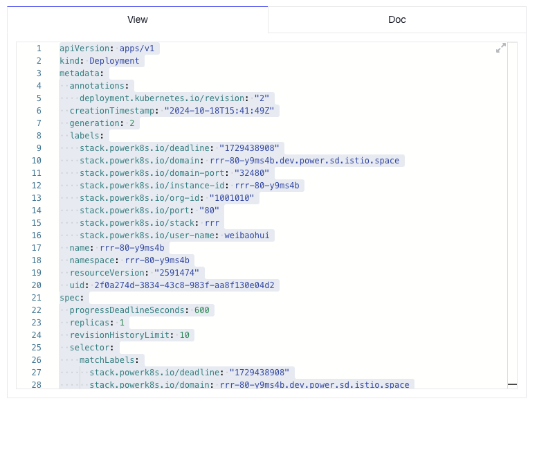
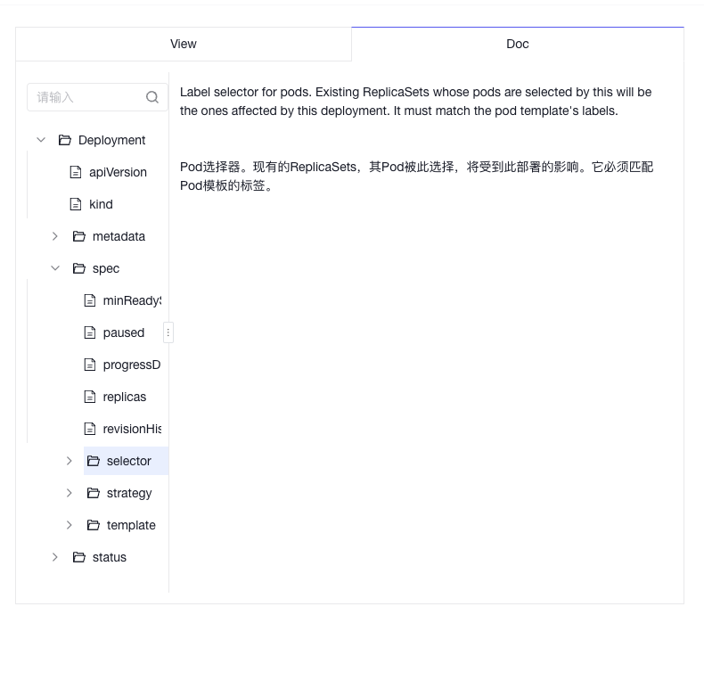
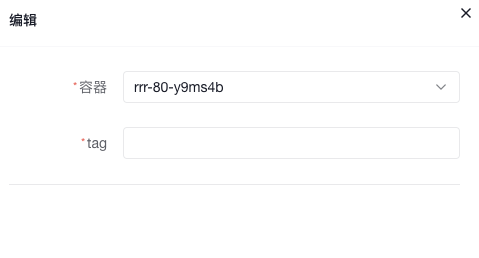

### **k8m**

**k8m** 是一个轻量级的 Kubernetes 仪表板，旨在提供简洁高效的集群管理体验。
基于[AMIS](https://github.com/baidu/amis)构建，并使用[kom](https://github.com/weibaohui/kom)作为 Kubernetes API 客户端。

### 主要特点：
- **迷你化设计**：所有功能集成在一个单一的可执行文件中，方便部署和使用。
- **简便易用**：用户友好的界面和直观的操作流程，使 Kubernetes 管理变得轻而易举。
- **高效性能**：使用百度Amis作为前端，利用 Golang 构建后端，确保高效的资源利用和快速响应。
- **Pod文件管理**：支持 Pod内目录浏览、文件浏览、文件编辑、文件下载、文件上传、文件删除，简化 Kubernetes 管理。
- **CRD管理**：支持对CRD资源的自动发现以及管理功能。
- **ChatGPT**：在资源编辑页面doc文档显示中，开启了ChatGPT翻译，自动将英文文档翻译为中文。
- **多平台支持**：支持 Linux、macOS 和 Windows，确保在多种平台下运行。
- **跨平台支持**：兼容多种架构，包括 **x86**、**ARM**、**PPC64LE**、**MIPS** 以及 **x390s**，确保在所有主要平台上顺畅运行。

- **k8m** 让你无需繁琐的配置，即可轻松管理 Kubernetes 集群，是开发者和运维人员的理想选择。


## **运行**
1. **下载**：从 [GitHub](https://github.com/weibaohui/k8m) 下载最新版本。
2. **运行**：使用 `./k8m` 命令启动,访问[http://127.0.0.1:3618](http://127.0.0.1:3618)。
3. **参数**：
```shell
  ./k8m -h
      --add_dir_header                   If true, adds the file directory to the header of the log messages
      --alsologtostderr                  log to standard error as well as files (no effect when -logtostderr=true)
  -k, --chatgpt-key string               API Key for ChatGPT (default "sk-XXXX")
  -u, --chatgpt-url string               API URL for ChatGPT (default "https://api.siliconflow.cn/v1")
  -d, --debug                            Debug mode,same as GIN_MODE
  -c, --kubeconfig string                Absolute path to the kubeConfig file (default "/Users/xxx/.kube/config")
      --log_backtrace_at traceLocation   when logging hits line file:N, emit a stack trace (default :0)
      --log_dir string                   If non-empty, write log files in this directory (no effect when -logtostderr=true)
      --log_file string                  If non-empty, use this log file (no effect when -logtostderr=true)
      --log_file_max_size uint           Defines the maximum size a log file can grow to (no effect when -logtostderr=true). Unit is megabytes. If the value is 0, the maximum file size is unlimited. (default 1800)
      --logtostderr                      log to standard error instead of files (default true)
      --one_output                       If true, only write logs to their native severity level (vs also writing to each lower severity level; no effect when -logtostderr=true)
  -p, --port int                         Port for the server to listen on (default 3618)
      --skip_headers                     If true, avoid header prefixes in the log messages
      --skip_log_headers                 If true, avoid headers when opening log files (no effect when -logtostderr=true)
      --stderrthreshold severity         logs at or above this threshold go to stderr when writing to files and stderr (no effect when -logtostderr=true or -alsologtostderr=true) (default 2)
  -v, --v Level                          number for the log level verbosity (default 0)
      --vmodule moduleSpec               comma-separated list of pattern=N settings for file-filtered logging
```

## **ChatGPT 配置指南**

### **环境变量配置**
需要设置环境变量，以启用ChatGPT。
```bash
export OPENAI_API_KEY="sk-XXXXX"
export OPENAI_API_URL="https://api.siliconflow.cn/v1"
```
### **ChatGPT 账户**
本项目集成了[github.com/sashabaranov/go-openai](https://github.com/sashabaranov/go-openai)SDK。
国内访问推荐使用[硅基流动](https://cloud.siliconflow.cn/)的服务。 登录后，在[https://cloud.siliconflow.cn/account/ak](https://cloud.siliconflow.cn/account/ak)创建API_KEY


## **Makefile 使用指南**

本项目中的 **Makefile** 用于自动化常见任务，如构建、测试和清理项目。以下是详细的使用说明，帮助你了解如何使用 Makefile 中定义的各个目标。

### **先决条件**

在使用 Makefile 之前，请确保你的系统上已安装以下工具：

- **Go（Golang）** - [下载并安装 Go](https://golang.org/dl/)
- **Make** - 通常预装在 Linux 和 macOS 系统中。对于 Windows 用户，可以考虑使用 [GNU Make for Windows](http://gnuwin32.sourceforge.net/packages/make.htm) 或 [WSL（Windows Subsystem for Linux）](https://docs.microsoft.com/zh-cn/windows/wsl/install)
- **Git** - 用于获取当前提交哈希

### **可用目标**

#### 1. **make**
- **描述**：默认目标，构建当前平台的可执行文件。
- **使用方法**：
  ```bash
  make
  ```
#### 2. **build**
- **描述**：根据当前系统的操作系统和架构，为当前平台构建可执行文件。
- **使用方法**：
```bash
make build
```

#### 3. **build-all**
- **描述**：为所有指定的平台和架构进行交叉编译，生成相应的可执行文件。
- **使用方法**：
  ```bash
  make build-all
  ```
- **输出**：不同平台的可执行文件将位于 `bin/` 目录中，命名格式为 `k8m-<GOOS>-<GOARCH>`（例如 `k8m-linux-amd64`、`k8m-windows-amd64.exe`）。

#### 4. **clean**
- **描述**：删除 `bin/` 目录及其中的所有编译生成的可执行文件。
- **使用方法**：
  ```bash
  make clean
  ```
- **输出**：`bin/` 目录及其内容将被删除。

#### 5. **run**
- **描述**：构建并运行当前平台的可执行文件。**注意**：此目标仅适用于 Unix 系统（Linux 和 macOS）。
- **使用方法**：
  ```bash
  make run
  ```
- **输出**：应用程序将在本地启动运行。

#### 6. **help**
- **描述**：显示所有可用的 Makefile 目标及其简要描述。
- **使用方法**：
  ```bash
  make help
  ```

### **跨平台编译支持**

**build-all** 目标支持以下操作系统和架构组合的交叉编译：

- **Linux**:
  - `amd64`
  - `arm64`
  - `ppc64le`
  - `s390x`
  - `mips64le`
  - `riscv64`
- **Darwin（macOS）**:
  - `amd64`
  - `arm64`
- **Windows**:
  - `amd64`
  - `arm64`

### **使用示例**

#### **1. 为当前平台构建**

构建适用于当前操作系统和架构的 `k8m` 可执行文件：
```bash
make build
```

#### **2. 为所有支持的平台构建**

交叉编译 `k8m` 为所有指定的平台和架构：
```bash
make build-all
```

#### **3. 运行可执行文件**

在 Unix 系统上构建并运行 `k8m`：
```bash
make run
```

#### **4. 清理构建产物**

删除所有编译生成的可执行文件和 `bin/` 目录：
```bash
make clean
```

#### **5. 查看帮助信息**

显示所有可用的 Makefile 目标及其描述：
```bash
make help
```

### **附加说明**

- **版本控制**：你可以在构建时通过传递 `VERSION` 变量来指定自定义版本：
  ```bash
  make build VERSION=v2.0.0
  ```
- **可执行文件扩展名**：对于 Windows 构建，Makefile 会自动为可执行文件添加 `.exe` 扩展名。
- **依赖性**：确保 Git 已安装并且项目已初始化为 Git 仓库，以便正确获取 `GIT_COMMIT` 哈希值。

### **故障排除**

- **缺少依赖**：如果遇到与缺少命令相关的错误（如 `make`、`go` 等），请确保所有先决条件已安装并正确配置在系统的 `PATH` 中。
- **权限问题**：如果在运行 `make run` 时收到权限被拒绝的错误，请确保 `bin/` 目录和编译后的二进制文件具有必要的执行权限：
  ```bash
  chmod +x bin/k8m
  ```

## **运行界面**
### 负载

### Pod内文件编辑

### 上传文件到Pod内

### Pod内文件下载

### yaml编辑

### yaml文档对照（开启了大模型翻译）

### Tag更新

### 查看日志


### HELP & SUPPORT
如果你有任何进一步的问题或需要额外的帮助，请随时与我联系！
