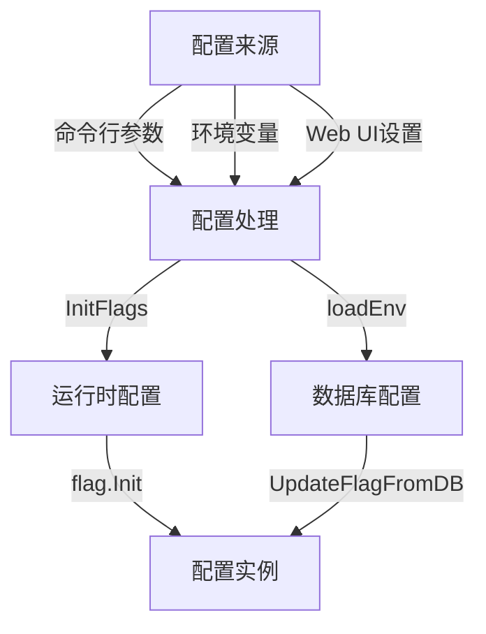

# K8M 配置选项说明

## 目录

- [K8M 配置选项说明](#k8m-配置选项说明)
    - [目录](#目录)
    - [配置概览](#配置概览)
    - [服务器配置](#服务器配置)
    - [AI集成配置](#ai-集成配置)
    - [认证配置](#认证配置)
    - [Kubernetes 连接配置](#kubernetes-连接配置)
    - [日志与调试配置](#日志与调试配置)
    - [数据库配置](#数据库配置)
    - [高级模型参数](#高级模型参数)
    - [缓存与产品配置](#缓存与产品配置)
    - [AI 输出控制](#ai-输出控制)
    - [配置方式](#配置方式)
        - [命令行参数](#命令行参数)
        - [环境变量](#环境变量)
        - [Web UI配置](#web-ui配置)

---

## 配置概览

K8M 支持通过以下方式进行配置（优先级从高到低）：

1. **命令行参数**
2. **环境变量**
3. **Web UI 中的数据库配置**

不同方式可根据需求灵活选择。



---

## 服务器配置

| 配置项      | 命令行参数            | 环境变量           | 默认值     | 描述         |
|----------|------------------|----------------|---------|------------|
| Web服务器端口 | `-p, --port`     | `PORT`         | `3618`  | Web 服务监听端口 |
| 启动时打印配置  | `--print-config` | `PRINT_CONFIG` | `false` | 启动时是否打印配置  |
| 产品名称     | `--product-name` | `PRODUCT_NAME` | `K8M`   | 产品名称       |

---

## AI 集成配置

| 配置项     | 命令行参数                 | 环境变量                | 默认值                      | 描述             |
|---------|-----------------------|---------------------|--------------------------|----------------|
| 启用AI    | `--enable-ai`         | `ENABLE_AI`         | `true`                   | 启用或禁用 AI 功能    |
| 使用内置模型  | `--use-builtin-model` | `USE_BUILTIN_MODEL` | `true`                   | 使用内置模型或自定义配置   |
| API Key | `-k, --chatgpt-key`   | `OPENAI_API_KEY`    |                          | 用于语言模型的 API 密钥 |
| API 地址  | `-u, --chatgpt-url`   | `OPENAI_API_URL`    |                          | 语言模型接口地址       |
| 使用模型    | `-m, --chatgpt-model` | `OPENAI_MODEL`      | Qwen/Qwen2.5-7B-Instruct | 使用的模型名称        |
| 任意选择启用  | `--any-select`        | `ANY_SELECT`        | `true`                   | 启用文本任意选择功能     |

---

## 认证配置

| 配置项      | 命令行参数                 | 环境变量                | 默认值               | 描述                 |
|----------|-----------------------|---------------------|-------------------|--------------------|
| 登录方式     | `--login-type`        | `LOGIN_TYPE`        | `password`        | 支持密码、OAuth、Token登录 |
| JWT密钥    | `--jwt-token-secret`  | `JWT_TOKEN_SECRET`  | `your-secret-key` | JWT签名密钥            |
| 临时管理员启用  | `--enable-temp-admin` | `ENABLE_TEMP_ADMIN` | `false`           | 是否启用临时管理员账户        |
| 临时管理员用户名 | `--admin-username`    | `ADMIN_USERNAME`    |                   | 临时管理员用户名           |
| 临时管理员密码  | `--admin-password`    | `ADMIN_PASSWORD`    |                   | 临时管理员密码            |

---

## Kubernetes 连接配置

| 配置项            | 命令行参数                   | 环境变量                  | 默认值                      | 描述              |
|----------------|-------------------------|-----------------------|--------------------------|-----------------|
| kubeconfig 路径  | `-c, --kubeconfig`      | `KUBECONFIG`          | `~/.kube/config`         | kubeconfig 文件路径 |
| In Cluster 模式  | `--in-cluster`          | `IN_CLUSTER`          | `true`                   | 自动管理宿主集群        |
| 启动时自动连接集群      | `--connect-cluster`     | `CONNECT_CLUSTER`     | `false`                  | 启动时连接发现的集群      |
| 节点Shell镜像      | `--node-shell-image`    | `NODE_SHELL_IMAGE`    | `alpine:latest`          | 节点访问用镜像         |
| KubectlShell镜像 | `--kubectl-shell-image` | `KUBECTL_SHELL_IMAGE` | `bitnami/kubectl:latest` | 用于 kubectl 的镜像  |
| 镜像拉取超时         | `--image-pull-timeout`  | `IMAGE_PULL_TIMEOUT`  | `30`                     | 镜像拉取超时时间（秒）     |

---

## 日志与调试配置

| 配置项  | 命令行参数         | 环境变量    | 默认值     | 描述          |
|------|---------------|---------|---------|-------------|
| 调试模式 | `-d, --debug` | `DEBUG` | `false` | 是否启用调试模式    |
| 日志级别 | `--log-v`     | `LOG_V` | `2`     | klog 日志详细级别 |

---

## 数据库配置

### 数据库选择

K8M 支持使用 sqlite、 mysql、postgresql 三种数据库。

| 配置项   | 命令行参数         | 环境变量        | 默认值      | 描述                        |
|-------|---------------|-------------|----------|---------------------------|
| 数据库类型 | `--db-driver` | `DB_DRIVER` | `sqlite` | sqlite 、 mysql、postgresql |

### SQLite

| 配置项        | 命令行参数           | 环境变量          | 默认值             | 描述             |
|------------|-----------------|---------------|-----------------|----------------|
| SQLite文件路径 | `--sqlite-path` | `SQLITE_PATH` | `./data/k8m.db` | SQLite 数据库文件路径 |

### MySQL

| 配置项  | 命令行参数               | 环境变量              | 默认值                        | 描述         |
|------|---------------------|-------------------|----------------------------|------------|
| 主机   | `--mysql-host`      | `MYSQL_HOST`      | `127.0.0.1`                | MySQL 主机   |
| 端口   | `--mysql-port`      | `MYSQL_PORT`      | `3306`                     | MySQL 端口   |
| 用户名  | `--mysql-user`      | `MYSQL_USER`      | `root`                     | MySQL 用户名  |
| 密码   | `--mysql-password`  | `MYSQL_PASSWORD`  |                            | MySQL 密码   |
| 数据库名 | `--mysql-database`  | `MYSQL_DATABASE`  | `k8m`                      | MySQL 数据库名 |
| 字符集  | `--mysql-charset`   | `MYSQL_CHARSET`   | `utf8mb4`                  | MySQL 字符集  |
| 排序规则 | `--mysql-collation` | `MYSQL_COLLATION` | `utf8mb4_general_ci`       | MySQL 排序规则 |
| 额外参数 | `--mysql-query`     | `MYSQL_QUERY`     | `parseTime=True&loc=Local` | MySQL 连接参数 |
| 日志模式 | `--mysql-logmode`   | `MYSQL_LOGMODE`   | `false`                    | MySQL 日志模式 |

### PostgreSQL

| 配置项   | 命令行参数           | 环境变量          | 默认值             | 描述               |
|-------|-----------------|---------------|-----------------|------------------|
| 主机    | `--pg-host`     | `PG_HOST`     | `127.0.0.1`     | PostgreSQL 主机    |
| 端口    | `--pg-port`     | `PG_PORT`     | `5432`          | PostgreSQL 端口    |
| 用户名   | `--pg-user`     | `PG_USER`     | `postgres`      | PostgreSQL 用户名   |
| 密码    | `--pg-password` | `PG_PASSWORD` |                 | PostgreSQL 密码    |
| 数据库名  | `--pg-database` | `PG_DATABASE` | `k8m`           | PostgreSQL 数据库名  |
| SSL模式 | `--pg-sslmode`  | `PG_SSLMODE`  | `disable`       | PostgreSQL SSL模式 |
| 时区    | `--pg-timezone` | `PG_TIMEZONE` | `Asia/Shanghai` | PostgreSQL 时区    |
| 日志模式  | `--pg-logmode`  | `PG_LOGMODE`  | `false`         | PostgreSQL 日志模式  |

| 数据库驱动类型 | `--db-driver`     | `DB_DRIVER`    | `sqlite`         | 数据库驱动类型: sqlite、mysql、postgresql等 |

---

## 高级模型参数

| 配置项     | 命令行参数              | 环境变量             | 默认值  | 描述                  |
|---------|--------------------|------------------|------|---------------------|
| 温度      |                    |                  |      | 语言模型温度（Temperature） |
| TopP    |                    |                  |      | 语言模型TopP参数          |
| 最大轮数    | `--max-iterations` | `MAX_ITERATIONS` | `10` | 模型自动对话的最大轮数         |
| 最大历史记录数 |                    |                  |      | 模型对话上下文历史记录数        |

---

## 缓存与产品配置

| 配置项       | 命令行参数                      | 环境变量                     | 默认值  | 描述     |
|-----------|----------------------------|--------------------------|------|--------|
| 资源缓存时间（秒） | `--resource-cache-timeout` | `RESOURCE_CACHE_TIMEOUT` | `60` | 资源缓存时间 |

---

## AI 输出控制

| 配置项    | 命令行参数     | 环境变量    | 默认值     | 描述                                  |
|--------|-----------|---------|---------|-------------------------------------|
| 思考过程输出 | `--think` | `THINK` | `false` | AI 是否开启思考过程输出，true 时显示思考过程，建议生产环境开启 |

---

## 配置方式

下面以`KUBECONFIG`参数为例给出使用配置

### 命令行参数

```shell
./k8m --port 8080 --kubeconfig /root/.kube/config
```

### 环境变量

- 环境变量适合容器化部署，或作为系统级配置。

```shell
export KUBECONFIG="/root/.kube/config"
./k8m
```

### yaml 方式配置

```shell
apiVersion: apps/v1
kind: Deployment
metadata:
  name: k8m
  namespace: k8m
  labels:
    app: k8m
spec:
  replicas: 1
  selector:
    matchLabels:
      app: k8m
  template:
    metadata:
      labels:
        app: k8m
    spec:
      containers:
        - name: k8m
          image: registry.cn-hangzhou.aliyuncs.com/minik8m/k8m:v0.0.123
          env:
            # kubeconfig文件路径，会自动扫描识别同级目录下所有的配置文件
            - name: KUBECONFIG
              value: "~/.kube/config"
```

### Web UI配置

- 可以在 Web UI 中配置并动态调整数据库配置、AI 集成选项、集群设置等。
- 如下AI模型管理
  


 