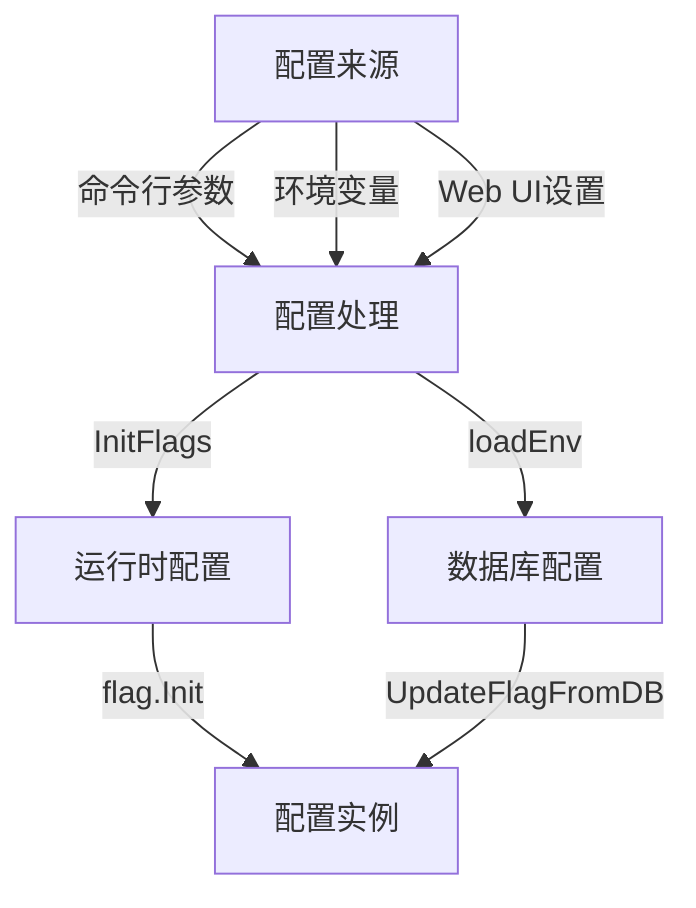

# K8M 配置选项说明

## 目录

- [K8M 配置选项说明](#k8m-配置选项说明)
  - [目录](#目录)
  - [配置概览](#配置概览)
  - [服务器配置](#服务器配置)
  - [AI 集成配置](#ai-集成配置)
  - [认证配置](#认证配置)
  - [Kubernetes 连接配置](#kubernetes-连接配置)
  - [日志与调试配置](#日志与调试配置)
  - [数据库配置](#数据库配置)
  - [配置方式](#配置方式)
    - [命令行参数](#命令行参数)
    - [环境变量](#环境变量)
    - [Web UI配置](#web-ui配置)

---

## 配置概览

K8M 支持通过以下方式进行配置（优先级从高到低）：

1. **命令行参数**
2. **环境变量**
3. **Web UI 中的数据库配置**

不同方式可根据需求灵活选择。

---

## 服务器配置

| 配置项         | 命令行参数              | 环境变量          | 默认值  | 描述               |
| -------------- | ----------------------- | ----------------- | ------- | ------------------ |
| Web服务器端口  | `-p, --port`            | `PORT`            | `3618`  | Web 服务监听端口   |
| MCP服务端口    | `-s, --mcp-server-port` | `MCP_SERVER_PORT` | `3619`  | 多集群平台监听端口 |
| 启动时打印配置 | `--print-config`        | `PRINT_CONFIG`    | `false` | 启动时是否打印配置 |

---

## AI 集成配置

| 配置项       | 命令行参数            | 环境变量            | 默认值 | 描述                     |
| ------------ | --------------------- | ------------------- | ------ | ------------------------ |
| 启用AI       | `--enable-ai`         | `ENABLE_AI`         | `true` | 启用或禁用 AI 功能       |
| 使用内置模型 | `--use-builtin-model` | `USE_BUILTIN_MODEL` | `true` | 使用内置模型或自定义配置 |
| API Key      | `-k, --chatgpt-key`   | `OPENAI_API_KEY`    |        | 用于语言模型的 API 密钥  |
| API 地址     | `-u, --chatgpt-url`   | `OPENAI_API_URL`    |        | 语言模型接口地址         |
| 使用模型     | `-m, --chatgpt-model` | `OPENAI_MODEL`      |        | 使用的模型名称           |
| 任意选择启用 | `--any-select`        | `ANY_SELECT`        | `true` | 启用文本任意选择功能     |

---

## 认证配置

| 配置项           | 命令行参数            | 环境变量            | 默认值        | 描述                       |
| ---------------- | --------------------- | ------------------- | ------------- | -------------------------- |
| 登录方式         | `--login-type`        | `LOGIN_TYPE`        | `password`    | 支持密码、OAuth、Token登录 |
| JWT密钥          | `--jwt-token-secret`  | `JWT_TOKEN_SECRET`  | `your-secret` | JWT签名密钥                |
| 临时管理员启用   | `--enable-temp-admin` | `ENABLE_TEMP_ADMIN` | `false`       | 是否启用临时管理员账户     |
| 临时管理员用户名 | `--admin-username`    | `ADMIN_USERNAME`    | `admin`       | 临时管理员用户名           |
| 临时管理员密码   | `--admin-password`    | `ADMIN_PASSWORD`    | `123456`      | 临时管理员密码             |

---

## Kubernetes 连接配置

| 配置项             | 命令行参数              | 环境变量              | 默认值                   | 描述                 |
| ------------------ | ----------------------- | --------------------- | ------------------------ | -------------------- |
| kubeconfig 路径    | `-c, --kubeconfig`      | `KUBECONFIG`          | `~/.kube/config`         | kubeconfig 文件路径  |
| In Cluster 模式    | `--in-cluster`          | `IN_CLUSTER`          | `true`                   | 自动管理宿主集群     |
| 启动时自动连接集群 | `--connect-cluster`     | `CONNECT_CLUSTER`     | `false`                  | 启动时连接发现的集群 |
| 节点Shell镜像      | `--node-shell-image`    | `NODE_SHELL_IMAGE`    | `alpine:latest`          | 节点访问用镜像       |
| KubectlShell镜像   | `--kubectl-shell-image` | `KUBECTL_SHELL_IMAGE` | `bitnami/kubectl:latest` | 用于 kubectl 的镜像  |

---

## 日志与调试配置

| 配置项   | 命令行参数    | 环境变量 | 默认值  | 描述              |
| -------- | ------------- | -------- | ------- | ----------------- |
| 调试模式 | `-d, --debug` | `DEBUG`  | `false` | 是否启用调试模式  |
| 日志级别 | `--log-v`     | `LOG_V`  | `2`     | klog 日志详细级别 |

---

## 数据库配置

| 配置项         | 命令行参数      | 环境变量      | 默认值          | 描述                  |
| -------------- | --------------- | ------------- | --------------- | --------------------- |
| SQLite文件路径 | `--sqlite-path` | `SQLITE_PATH` | `./data/k8m.db` | SQLite 数据库文件路径 |

---

## 配置方式

### 命令行参数

- 命令行参数优先级最高，通常在启动时提供。
- 启动时，可以根据需要传递特定配置项。

### 环境变量

- 环境变量适合容器化部署，或作为系统级配置。
- 例如，`KUBECONFIG` 可通过环境变量来指定 kubeconfig 文件路径。

### Web UI配置

- 可以在 Web UI 中配置并动态调整数据库配置、AI 集成选项、集群设置等。
- 适合在生产环境中动态管理配置。

 