# MCP GitHub Copilot 配置指南

1. 切换到Agent模式
   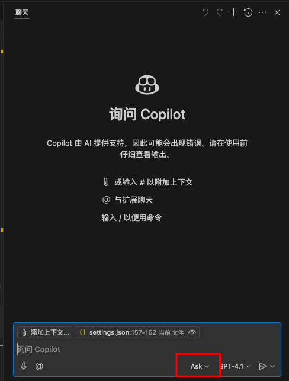
   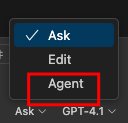
2. 选择添加更多工具
   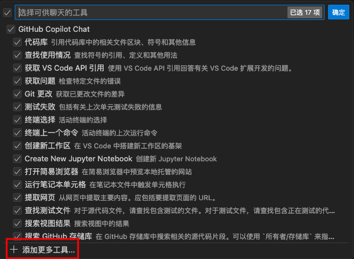
3. 选择添加MCP服务器
   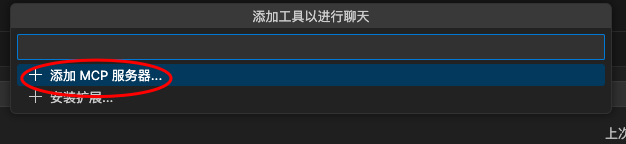

4. 复制http://IP:3618/mcp/k8m/sse 粘贴进去。
   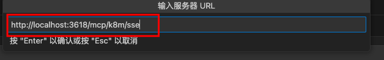

5. 填写服务器名称：k8s-mcp
   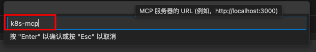

6. 填写Header 认证。
    - 认证密钥获取位置：k8m 个人中心-开放MCP-创建Token
    - 复制 Auth 认证值。形如“eyJhbGciOiJIUzI1Ni...”
    - 填写 Header 认证。

```json
{
  "mcp": {
    "servers": {
      "k8s-mcp": {
        "url": "http://localhost:3618/mcp/k8m/sse",
        "headers": {
          "Authorization": "eyJhbGciOiJIUzI1..."
        }
      }
    }
  }
}
```

7. 点击启动按钮
   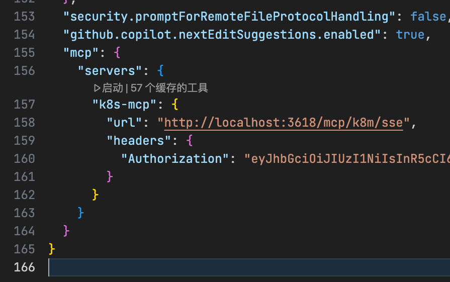

8. 可以看到运行状态
   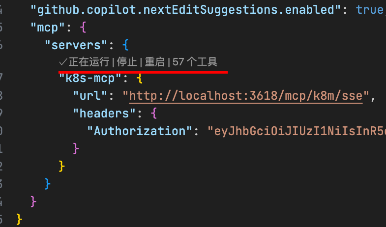

9. 开启或关闭部分Tools工具 开关
   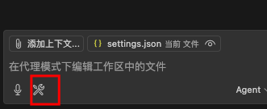

10. 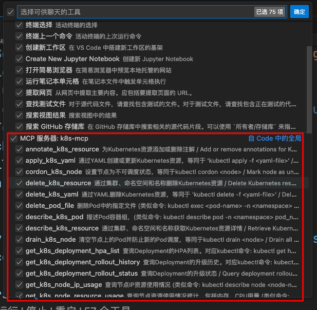

11. 使用示例
    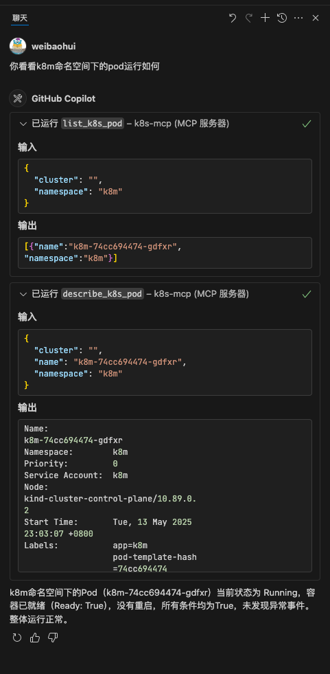
