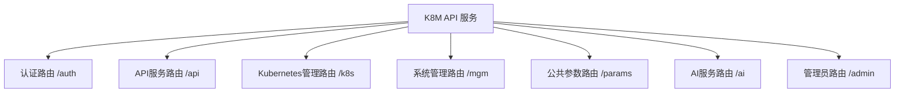
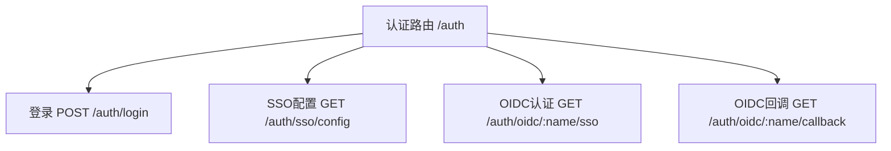
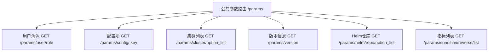
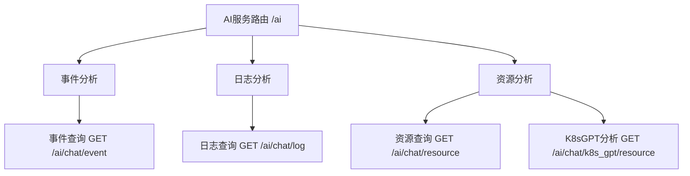
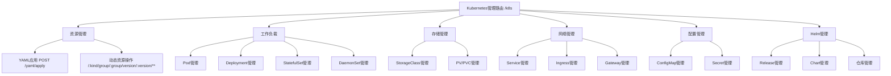
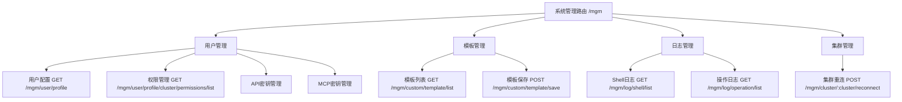
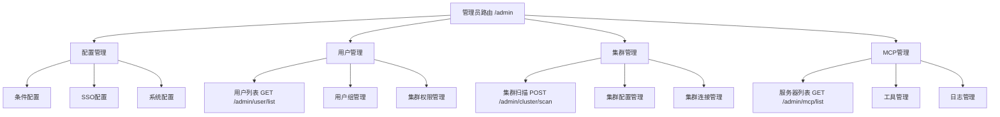

# K8M 系统路由结构图

## 系统总览

```mermaid
graph TD
    A[K8M API 服务] --> B[认证路由 /auth]
    A --> C[API服务路由 /api]
    A --> D[Kubernetes管理路由 /k8s]
    A --> E[系统管理路由 /mgm]
    A --> F[公共参数路由 /params]
    A --> G[AI服务路由 /ai]
    A --> H[管理员路由 /admin]
```

## 认证路由

```mermaid
graph TD
    B[认证路由 /auth] --> B1[登录 POST /auth/login]
    B --> B2[SSO配置 GET /auth/sso/config]
    B --> B3[OIDC认证 GET /auth/oidc/:name/sso]
    B --> B4[OIDC回调 GET /auth/oidc/:name/callback]
```

## 公共参数路由

```mermaid
graph TD
    F[公共参数路由 /params] --> F1[用户角色 GET /params/user/role]
    F --> F2[配置项 GET /params/config/:key]
    F --> F3[集群列表 GET /params/cluster/option_list]
    F --> F4[版本信息 GET /params/version]
    F --> F5[Helm仓库 GET /params/helm/repo/option_list]
    F --> F6[指标列表 GET /params/condition/reverse/list]
```

## AI服务路由

```mermaid
graph TD
    G[AI服务路由 /ai] --> G1[事件分析]
    G --> G2[日志分析]
    G --> G3[资源分析]

    G1 --> G1_1[事件查询 GET /ai/chat/event]
    G2 --> G2_1[日志查询 GET /ai/chat/log]
    G3 --> G3_1[资源查询 GET /ai/chat/resource]
    G3 --> G3_2[K8sGPT分析 GET /ai/chat/k8s_gpt/resource]
```

## Kubernetes管理路由

```mermaid
graph TD
    D[Kubernetes管理路由 /k8s] --> D1[资源管理]
    D --> D2[工作负载]
    D --> D3[存储管理]
    D --> D4[网络管理]
    D --> D5[配置管理]
    D --> D6[Helm管理]

    %% 资源管理子节点
    D1 --> D1_1[YAML应用 POST /yaml/apply]
    D1 --> D1_2[动态资源操作 /:kind/group/:group/version/:version/**]

    %% 工作负载子节点
    D2 --> D2_1[Pod管理]
    D2 --> D2_2[Deployment管理]
    D2 --> D2_3[StatefulSet管理]
    D2 --> D2_4[DaemonSet管理]

    %% 存储管理子节点
    D3 --> D3_1[StorageClass管理]
    D3 --> D3_2[PV/PVC管理]

    %% 网络管理子节点
    D4 --> D4_1[Service管理]
    D4 --> D4_2[Ingress管理]
    D4 --> D4_3[Gateway管理]

    %% 配置管理子节点
    D5 --> D5_1[ConfigMap管理]
    D5 --> D5_2[Secret管理]

    %% Helm管理子节点
    D6 --> D6_1[Release管理]
    D6 --> D6_2[Chart管理]
    D6 --> D6_3[仓库管理]
```

## 系统管理路由

```mermaid
graph TD
    E[系统管理路由 /mgm] --> E1[用户管理]
    E --> E2[模板管理]
    E --> E3[日志管理]
    E --> E4[集群管理]

    %% 用户管理子节点
    E1 --> E1_1[用户配置 GET /mgm/user/profile]
    E1 --> E1_2[权限管理 GET /mgm/user/profile/cluster/permissions/list]
    E1 --> E1_3[API密钥管理]
    E1 --> E1_4[MCP密钥管理]

    %% 模板管理子节点
    E2 --> E2_1[模板列表 GET /mgm/custom/template/list]
    E2 --> E2_2[模板保存 POST /mgm/custom/template/save]

    %% 日志管理子节点
    E3 --> E3_1[Shell日志 GET /mgm/log/shell/list]
    E3 --> E3_2[操作日志 GET /mgm/log/operation/list]

    %% 集群管理子节点
    E4 --> E4_1[集群重连 POST /mgm/cluster/:cluster/reconnect]
```

## 管理员路由

```mermaid
graph TD
    H[管理员路由 /admin] --> H1[配置管理]
    H --> H2[用户管理]
    H --> H3[集群管理]
    H --> H4[MCP管理]

    %% 配置管理子节点
    H1 --> H1_1[条件配置]
    H1 --> H1_2[SSO配置]
    H1 --> H1_3[系统配置]

    %% 用户管理子节点
    H2 --> H2_1[用户列表 GET /admin/user/list]
    H2 --> H2_2[用户组管理]
    H2 --> H2_3[集群权限管理]

    %% 集群管理子节点
    H3 --> H3_1[集群扫描 POST /admin/cluster/scan]
    H3 --> H3_2[集群配置管理]
    H3 --> H3_3[集群连接管理]

    %% MCP管理子节点
    H4 --> H4_1[服务器列表 GET /admin/mcp/list]
    H4 --> H4_2[工具管理]
    H4 --> H4_3[日志管理]
```