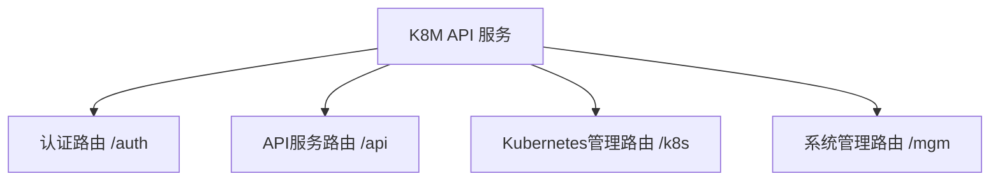
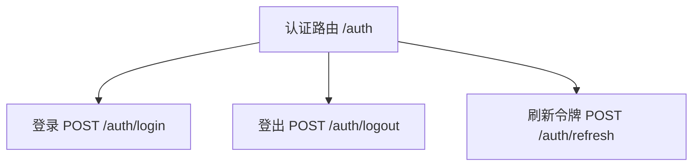
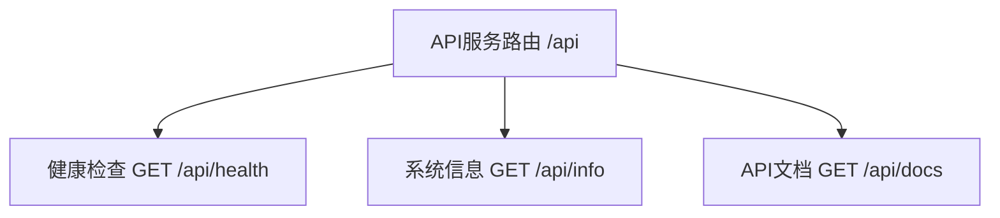
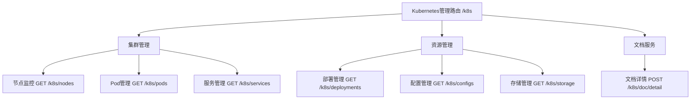
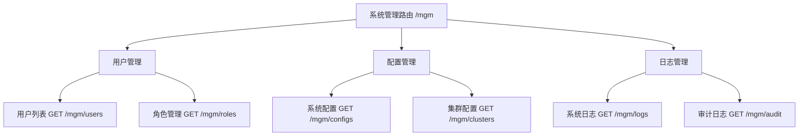

# K8M 系统路由结构图

## 系统总览

```mermaid
graph TD
    A[K8M API 服务] --> B[认证路由 /auth]
    A --> C[API服务路由 /api]
    A --> D[Kubernetes管理路由 /k8s]
    A --> E[系统管理路由 /mgm]

```

## 认证路由

```mermaid
graph TD
    B[认证路由 /auth] --> B1[登录 POST /auth/login]
    B --> B2[登出 POST /auth/logout]
    B --> B3[刷新令牌 POST /auth/refresh]

    
```

## API服务路由

```mermaid
graph TD
    C[API服务路由 /api] --> C1[健康检查 GET /api/health]
    C --> C2[系统信息 GET /api/info]
    C --> C3[API文档 GET /api/docs]

    
```

## Kubernetes管理路由

```mermaid
graph TD
    D[Kubernetes管理路由 /k8s] --> D1[集群管理]
    D --> D2[资源管理]
    D --> D3[文档服务]

    %% 集群管理子节点
    D1 --> D1_1[节点监控 GET /k8s/nodes]
    D1 --> D1_2[Pod管理 GET /k8s/pods]
    D1 --> D1_3[服务管理 GET /k8s/services]

    %% 资源管理子节点
    D2 --> D2_1[部署管理 GET /k8s/deployments]
    D2 --> D2_2[配置管理 GET /k8s/configs]
    D2 --> D2_3[存储管理 GET /k8s/storage]

    %% 文档服务子节点
    D3 --> D3_1[文档详情 POST /k8s/doc/detail]

   
```

## 系统管理路由

```mermaid
graph TD
    E[系统管理路由 /mgm] --> E1[用户管理]
    E --> E2[配置管理]
    E --> E3[日志管理]

    %% 用户管理子节点
    E1 --> E1_1[用户列表 GET /mgm/users]
    E1 --> E1_2[角色管理 GET /mgm/roles]

    %% 配置管理子节点
    E2 --> E2_1[系统配置 GET /mgm/configs]
    E2 --> E2_2[集群配置 GET /mgm/clusters]

    %% 日志管理子节点
    E3 --> E3_1[系统日志 GET /mgm/logs]
    E3 --> E3_2[审计日志 GET /mgm/audit]

    
```